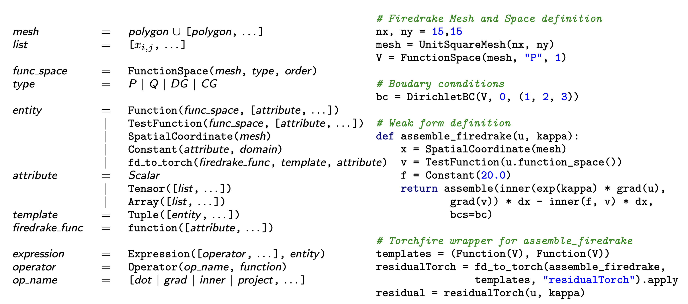
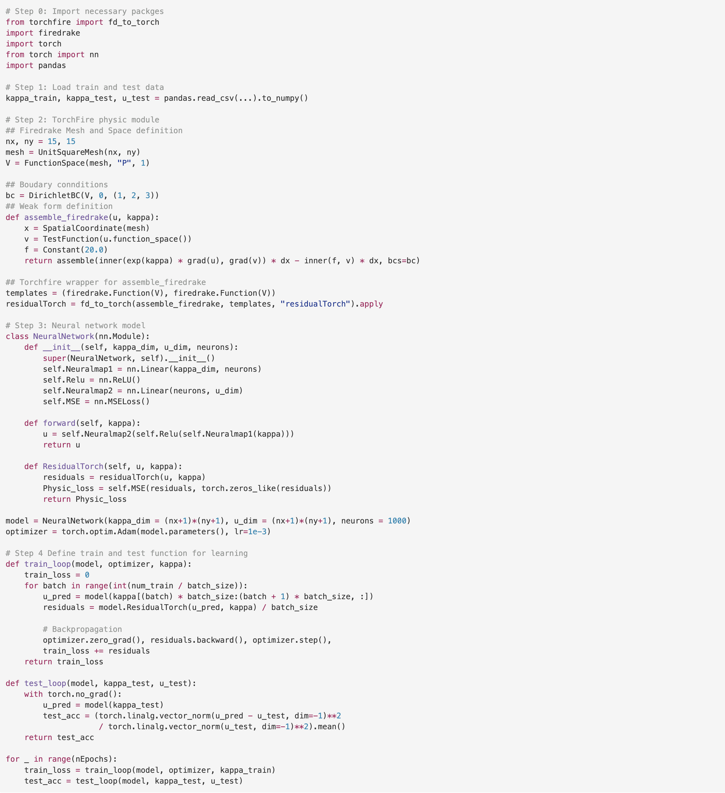

# Code Grammar Configuration
### Code grammar

<!-- 

 -->

 Left column: Firedrake grammar summary used to express loss functionals within TorchFire. We define our
domain as a union of polygonal patches, supporting unstructured hex/quad/triangle/tet meshes. The definition of entities
and function spaces includes attributes providing additional information that aids during code-generation. Expressions can
be defined using operators and entities. Finally, code is generated by specifying the target and host for a generation. Right
column: a working code example in TorchFire. In this case, u and κ are expected to be Torch tensors (given data and
predicted by the neural network, respectively) with size (nx + 1) × (ny + 1) = 256

### Code example for solving hear equation demos

