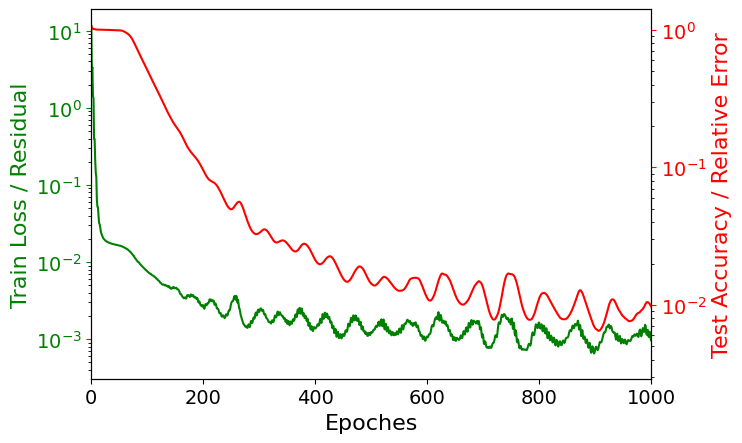

## **TorchFire**

<p align="center">

</p>

TorchFire strategically synergizes decades of developing machine learning libraries with scientific computation platforms to construct a SciMLCI that is equally appealing to experts in numerical methods, computer science, statistics, and domain scientists/engineers for their SciML research

### **Team Members** 

* [Tan Bui-Thanh (lead PI, UT Austin)](https://users.oden.utexas.edu/~tanbui/)[(Email)](mailto:tanbui@oden.utexas.edu)
* [Clint Dawson (UT Austin)](https://www.ae.utexas.edu/people/faculty/faculty-directory/dawson)
* [Michael Sacks (UT Austin)](https://wccms.oden.utexas.edu/people.html)
* [Ofodike Ezekoye (UT Austin)](https://www.utfireresearch.com/)
* [Robert Kirby (Baylor University)](https://sites.baylor.edu/robert_kirby/)
* [David Ham (Imperial College London)](https://www.imperial.ac.uk/people/david.ham)
* [John Shadid (University of New Mexico)](https://www.sandia.gov/ccr/staff/john-n-shadid/)
* [Leticia Ramirez-Ramirez (Center for mathematical investigation, Mexico)](https://www.math.uwaterloo.ca/~llramire/CVNov09.pdf)

### **Postdoctoral Researchers**

* TBA


### **Graduate Researchers**

* TBA


### **Undergraduate Researchers**

* TBA


### **Summer school opportunities**

* TBA

### **Applications**

Forecasting, monitoring, mitigating and controlling of fire spread and cardiovascular problems (CBET, DMS), hurricanes and storm surges (OCE, DMS), infectious disease outbreaks (BIO, CBET, DMS), and magnetohydrodynamics (PHY, DMS)


## **Demos and preliminary results**
### Problem settings 
#### *Solving heat equation with neural network:*
In this problem, we learn the neural network to solve for the temperature $u$ given arbitrary conductivity field $\kappa$. 2D hear equation is written as follows

$$
\begin{aligned}
         -\nabla \cdot \left .( {e^\kappa \nabla u} \right.) & = f  \quad \text{in } \Omega = \left .[ {0,1}^2 \right.]\\
        u & = 0 \quad \text{ on } \Gamma^{\text{ext}} \\
        \textbf{n} \cdot \left.({e^\kappa \nabla u}\right.) & = 0 \quad \text{ on } \Gamma^{\text{root}},
\end{aligned}
$$


#### *Results: comparison of solutions by Firedrake and TorchFire neural network*
<p align="center">

<figcaption><b>Figure 1: Training loss and test accuracy versus the training epochs<figcaption>
<p>

<p align="center">

<figcaption><b>Figure 2: (Left) conductivity field, (Middle) Predicted solution obtained by TorchFire neural network, (Right) True solution obtained by Firedrake software <figcaption>
<p>

#### *Demo code, TorchFire*

```python
# Step 0: Import necessary packges
from torchfire import fd_to_torch
import firedrake
import torch
from torch import nn
import pandas

# Step 1: Load train and test data
kappa_train, kappa_test, u_test = pandas.read_csv(...).to_numpy()

# Step 2: TorchFire physic module
## Firedrake Mesh and Space definition
nx, ny = 15, 15
mesh = UnitSquareMesh(nx, ny)
V = FunctionSpace(mesh, "P", 1)

## Boudary connditions
bc = DirichletBC(V, 0, (1, 2, 3))
## Weak form definition
def assemble_firedrake(u, kappa):
    x = SpatialCoordinate(mesh)
    v = TestFunction(u.function_space())
    f = Constant(20.0)
    return assemble(inner(exp(kappa) * grad(u), grad(v)) * dx - inner(f, v) * dx, bcs=bc)
    
## Torchfire wrapper for assemble_firedrake
templates = (firedrake.Function(V), firedrake.Function(V))
residualTorch = fd_to_torch(assemble_firedrake, templates, "residualTorch").apply

# Step 3: Neural network model
class NeuralNetwork(nn.Module):
    def __init__(self, kappa_dim, u_dim, neurons):
        super(NeuralNetwork, self).__init__()
        self.Neuralmap1 = nn.Linear(kappa_dim, neurons)
        self.Relu = nn.ReLU()
        self.Neuralmap2 = nn.Linear(neurons, u_dim)
        self.MSE = nn.MSELoss()

    def forward(self, kappa):
        u = self.Neuralmap2(self.Relu(self.Neuralmap1(kappa)))
        return u
        
    def ResidualTorch(self, u, kappa):
        residuals = residualTorch(u, kappa)
        Physic_loss = self.MSE(residuals, torch.zeros_like(residuals))
        return Physic_loss
        
model = NeuralNetwork(kappa_dim = (nx+1)*(ny+1), u_dim = (nx+1)*(ny+1), neurons = 1000)
optimizer = torch.optim.Adam(model.parameters(), lr=1e-3)

# Step 4 Define train and test function for learning
def train_loop(model, optimizer, kappa):
    train_loss = 0
    for batch in range(int(num_train / batch_size)):
        u_pred = model(kappa[(batch) * batch_size:(batch + 1) * batch_size, :])
        residuals = model.ResidualTorch(u_pred, kappa) / batch_size
        
        # Backpropagation
        optimizer.zero_grad(), residuals.backward(), optimizer.step(),
        train_loss += residuals
    return train_loss
        
def test_loop(model, kappa_test, u_test):
    with torch.no_grad():
        u_pred = model(kappa_test)
        test_acc = (torch.linalg.vector_norm(u_pred - u_test, dim=-1)**2
                    / torch.linalg.vector_norm(u_test, dim=-1)**2).mean()
    return test_acc

for _ in range(nEpochs):
    train_loss = train_loop(model, optimizer, kappa_train)
    test_acc = test_loop(model, kappa_test, u_test)
```


